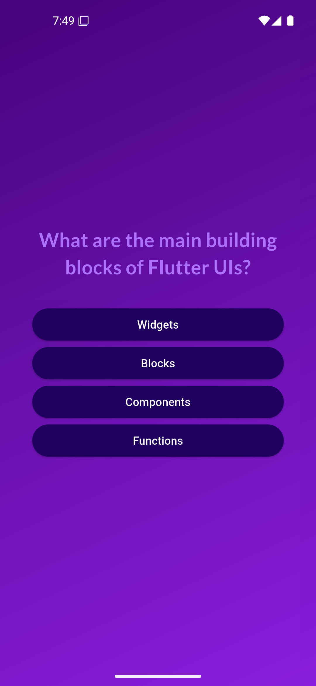
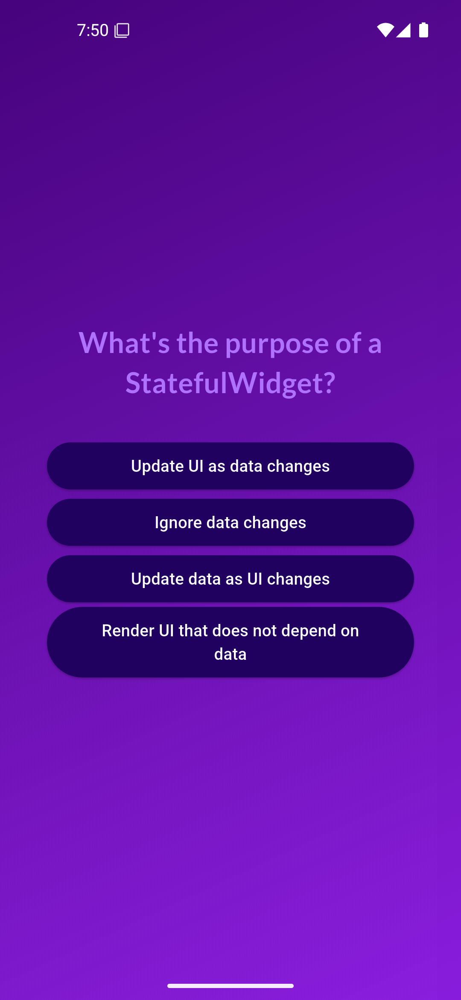
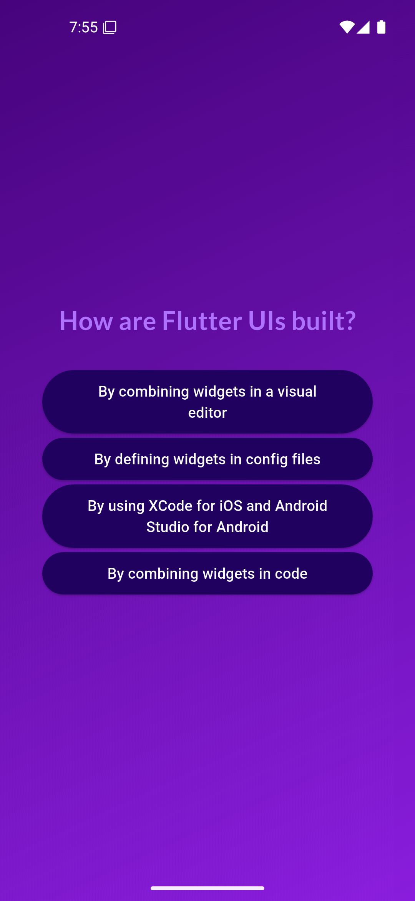
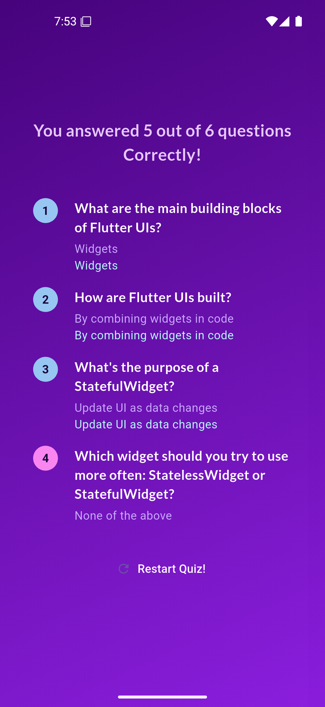

# 🧠 Quiz App

A **Flutter-based Quiz App** that provides an engaging way to test knowledge with interactive multiple-choice questions.


## ✨ Features

- **Dynamic Questions** – Load quiz questions dynamically.
- **Score Tracking** – Keep track of correct answers.
- **Interactive UI** – User-friendly interface with animations.
- **Custom Fonts & Icons** – Styled with Google Fonts and Cupertino Icons.
- **Correct & Incorrect Answers Highlighting** – Right answers are highlighted in blue, and wrong answers in pink at the end of the quiz.

## 📸 Screenshots

<p align="center">
  
  
  
  
  
  
</p>


## 📚 Dependencies

| Package           | Purpose                                    |
|-------------------|--------------------------------------------|
| `flutter`        | Core Flutter SDK.                         |
| `cupertino_icons` | iOS-style icons for UI elements.         |
| `google_fonts`   | Custom fonts for better aesthetics.       |


### Install dependencies using:
```sh
flutter pub get
```


## Installation

1. Clone the repository:
   ```sh
   git clone https://github.com/yourusername/quiz_app.git
   ```
2. Navigate to the project directory:
   ```sh
   cd quiz_app
   ```
3. Run the app:
   ```sh
   flutter run
   ```

